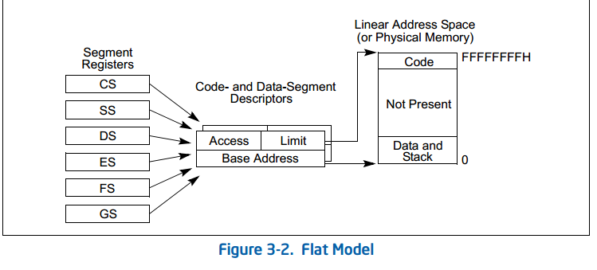

## linux 的内存管理

### 8086系列的实模式

 8088有1M的地址空间，访存没有虚存映射的过程，完全是对物理地址的访问（00000~FFFFF）。
 20位的地址涉及到两个寄存器，selector和offset，通常是[selector:offset]的形式，如[f000:fff0]。
 实际地址的计算规则是selector左移4位加上offset
 
### 80286 的保护模式

